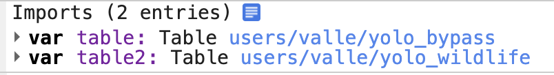

# Yolo Bypass and Wildlife Area Inundation Mapping using Sentinel-1 and Sentinel-2
### Code Author: Julia Burmistrova

When you open the Google Earth Engine program, you will see the following user interface. 

## Getting Started
# Import the shapefiles
You will need to import the shapefiles in the following order: [Yolo Bypass](https://code.earthengine.google.com/?asset=users/valle/yolo_bypass) and then [Yolo Wildlife](https://code.earthengine.google.com/?asset=users/valle/yolo_wildlife)

The code will look like this:

