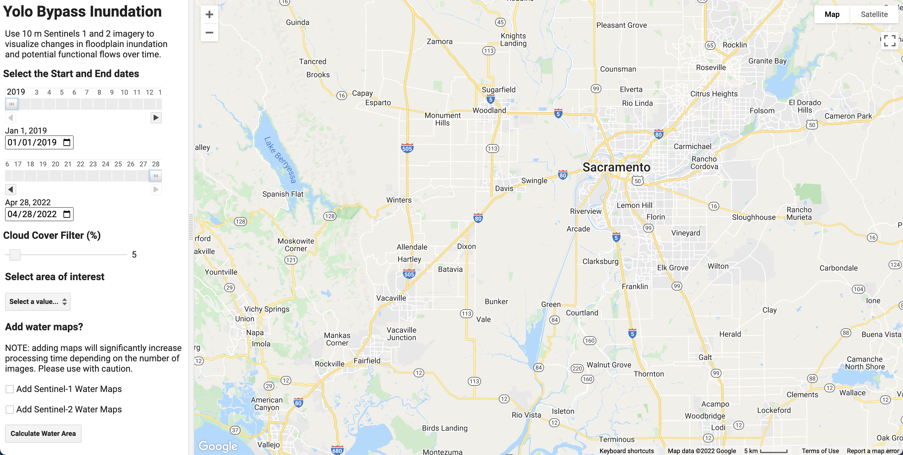

# Yolo Bypass and Wildlife Area Inundation Mapping using Sentinel-1 and Sentinel-2
### Code Author: Julia Burmistrova

When you open the Google Earth Engine program, you will see the following user interface. 

# Getting Started
## Import the shapefiles
You will need to import the shapefiles in the following order: [Yolo Bypass](https://code.earthengine.google.com/?asset=users/valle/yolo_bypass) and then [Yolo Wildlife](https://code.earthengine.google.com/?asset=users/valle/yolo_wildlife)

## Click the "Run" button
This will launch the User Interface where you can select different options. This might take a minute or so to load.  

## Select Options
Next select the following options
- Start Date
- End Date
- Shapefile/location
- Cloud Cover (Sentinel-2 only)
- Water maps (individual for 

WARNING: 
- Select the shapefile, or location, you are interested to run. If not, the code will not run.
- Adding water maps will significantly increase how long the code runs. Select a shorter date range and use with caution. 

# Example Output 

